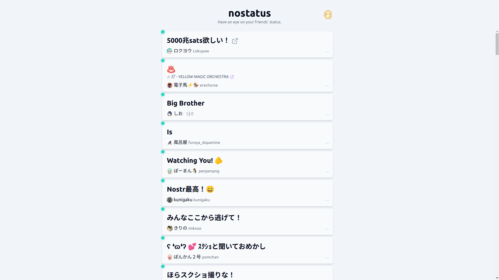
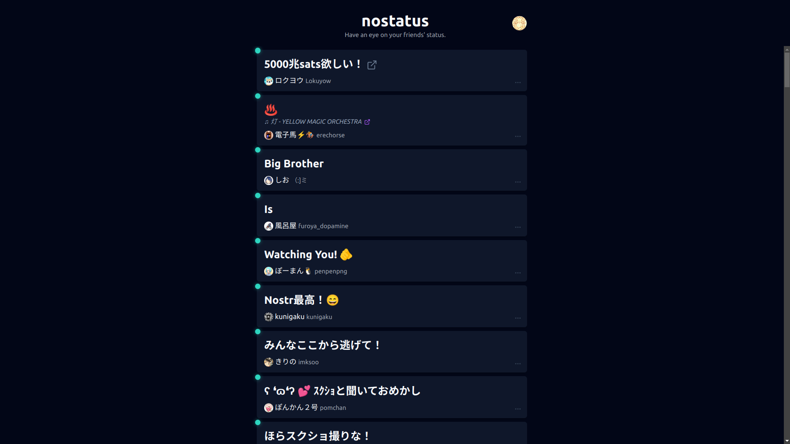
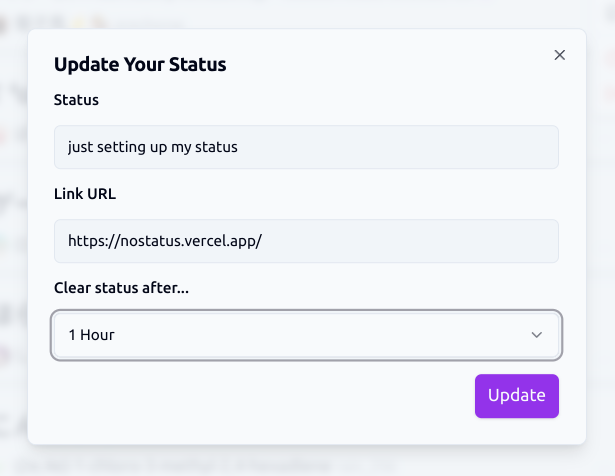

<h1>nostatus</h1>

A Nostr web client specialized in browsing user status ([NIP-38](https://github.com/nostr-protocol/nips/blob/master/38.md)).

**Try it out at: https://nostatus.vercel.app**

## Features

- 👀 Your friends' user status at a glance
- 🎵 Checking out "now playing" (`music` status) of your followees
- ✨ Updating your status with URL link and expiration
- 📲 PWA ready
- 🌓 Light & dark color themes

## Screenshots

### User Status Timeline - Light

### User Status Timeline - Dark

### Status Update Dialog

